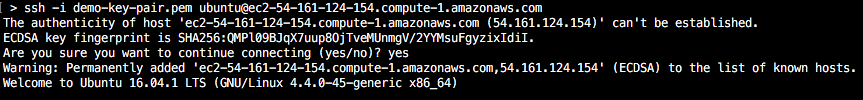

# Cloud and CI Demo

    Leverage AWS to create a CI/CD Pipeline using Jenkins

## Project Goals
* Demonstrate the benefits of Cloud and CI
* Demonstrate AWS basics
* Demonstrate Jenkins basics

## Warning: AWS costs money

## Prerequisites
* [Install Java](https://java.com/en/download/help/index_installing.xml)
* [Install Maven](http://maven.apache.org/install.html)
* [Install Git](https://git-scm.com/book/en/v2/Getting-Started-Installing-Git)
* AWS account and AWS CLI
  1. [Getting Set Up with the AWS Command Line Interface](http://docs.aws.amazon.com/cli/latest/userguide/cli-chap-getting-set-up.html)
  + [Installing the AWS Command Line Interface](http://docs.aws.amazon.com/cli/latest/userguide/installing.html)
  + [Configuring the AWS Command Line Interface (Quick Configuration)](http://docs.aws.amazon.com/cli/latest/userguide/cli-chap-getting-started.html#cli-quick-configuration)
* SSH client
  * Demo will assume you can: [Connect to Your Linux Instance](http://docs.aws.amazon.com/AWSEC2/latest/UserGuide/AccessingInstances.html)

## Notes
* I am using a Mac.  I will do my best to provide helpful links for Windows users.
* Common ways to use AWS:
  1. [AWS CLI](https://aws.amazon.com/cli/)
  + [AWS Console](https://console.aws.amazon.com)
* During this demo we will use the AWS CLI
  
## Demo

### 1. Make sure everything is installed.  Open command line and enter these commands:
`java -version`  
`mvn -version`  
`git version`  
`aws --version`  

<br/>
### 2. Run the Java Application locally
> Under the `app/` folder, there is a Java application.  Let's get it running.  

```
cd /<path>/app/
mvn clean package
java -jar target/app-0.1.0.jar
```
Using your browser, enter the following url: `http://localhost:8080`

<br/>

### 3. Set up AWS key pair and security group  

[Creating a key pair](http://docs.aws.amazon.com/cli/latest/userguide/cli-ec2-keypairs.html#creating-a-key-pair) - click link if using Windows
```
aws ec2 create-key-pair --key-name demo-key-pair --query 'KeyMaterial' --output text > demo-key-pair.pem
```
Restrict permissions (optional but recommended)
```
chmod 400 demo-key-pair.pem
```
Creating a Security Group
```
aws ec2 create-security-group --group-name demo-sg --description "Demo security group"
aws ec2 authorize-security-group-ingress --group-name demo-sg --protocol tcp --port 22 --cidr 0.0.0.0/0
aws ec2 authorize-security-group-ingress --group-name demo-sg --protocol tcp --port 80 --cidr 0.0.0.0/0
aws ec2 authorize-security-group-ingress --group-name demo-sg --protocol tcp --port 8080 --cidr 0.0.0.0/0
```

<br/>
### 4. Launch EC2 instance for Jenkins

Launch Jenkins EC2 instance
```
aws ec2 run-instances --image-id ami-40d28157 --instance-type t2.micro --key-name demo-key-pair --security-groups demo-sg
```
Get Jenkins **InstanceId** and **Public DNS Name**.  
The Public DNS Name will look like: `ec2-54-225-193-182.compute-1.amazonaws.com`.  We will call this `<jenkinsDnsName>`.
The instanceId will look like: `i-051ac82e682fe22de`.  We will call this: `<jenkinsId>`.  
```
aws ec2 describe-instances --query 'Reservations[].Instances[].[PublicDnsName, InstanceId, Tags[*]]' --filters "Name=instance-type,Values=t2.micro"
```
Tag Jenkins EC2 instance
```
aws ec2 create-tags --resources <jenkinsId> --tags "Key=Name,Value=jenkins"
```

<br/>
### 5. Connect to Jenkins EC2 instance

SSH into the Jenkins EC2 instance
```
ssh -i demo-key-pair.pem ubuntu@<jenkinsDnsName>
```
Type in `yes` and press `Enter`  


<br/>
### 6. Configure Jenkins EC2 instance

While logged into the EC2 instance, run the commands in `ec2-jenkins.sh`.

Using your browser, enter the following url: `http://<jenkinsDnsName>:8080`

Find the default Jenkins password
```
sudo cat /var/lib/jenkins/secrets/initialAdminPassword
```
Enter default Jenkins password

Install suggested plugins

Enter admin info

<br/>
### 7. Launch EC2 instance for our Java App

Launch Java App EC2 instance
```
aws ec2 run-instances --image-id ami-40d28157 --instance-type t2.micro --key-name demo-key-pair --security-groups demo-sg
```
Get Java App **InstanceId** and **Public DNS Name**.  
The Public DNS Name will look like: `ec2-54-225-193-182.compute-1.amazonaws.com`.  We will call this `<appDnsName>`.
The instanceId will look like: `i-051ac82e682fe22de`.  We will call this: `<appId>`.  
```
aws ec2 describe-instances --query 'Reservations[].Instances[].[PublicDnsName, InstanceId, Tags[*]]' --filters "Name=instance-type,Values=t2.micro"
```
Tag Java App EC2 instance
```
aws ec2 create-tags --resources <appId> --tags "Key=Name,Value=app"
```

<br/>
### 8. Connect to Java App EC2 instance

SSH into the Java App EC2 instance
```
ssh -i demo-key-pair.pem ubuntu@<appDnsName>
```

<br/>
### 9. Configure Java App EC2 instance

While logged into the EC2 instance, run the commands in `ec2-app.sh`.

<br/>
### 10. Create Jenkins job
> Now that we have our build and app servers configured, let's create a Jenkins job to build and deploy our app.

